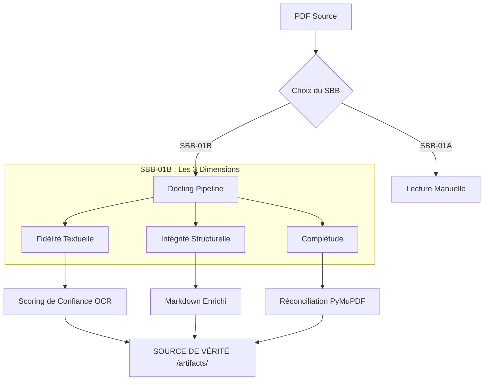
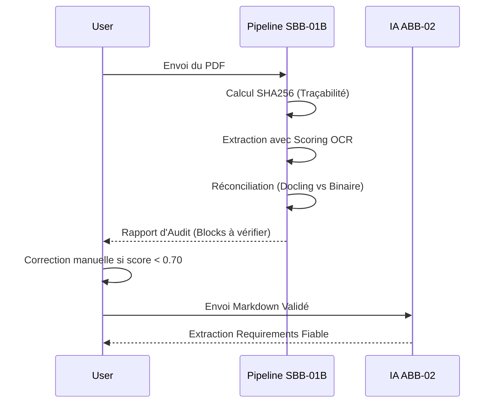

# ABB-01 — Ingestion du Besoin : Documentation de Référence

## 🎯 Problème et Invariant
**Problème à résoudre :** Un RFP arrive sous forme de PDF non structuré. L'extraire manuellement prend 2-4h de copier-coller. Avec ce pipeline, l'extraction prend 15-30 min, suivie de 30 min de vérification ciblée.

**L'Invariant :** Quel que soit le moteur (SBB-01A, B ou C), la sortie est **identique** :
1. Un **Markdown structuré** (lisible par l'homme et l'IA).
2. Des **Tableaux d'exigences** au format CSV.
3. Une **Fiche de réception** complétée.

---

## 🏗 Architecture du Pipeline de Fiabilité



---

## 🧠 Classification Automatique des Rôles
Le pipeline utilise une analyse par mots-clés pour catégoriser chaque document et déterminer le prompt IA associé à l'étape ABB-02 :

| Rôle | Mots-clés détectés | Prompt IA associé |
|:---|:---|:---|
| **CCTP** | cctp, technique, technical | `ABB-02-extraction-exigences.md` |
| **CCAP** | ccap, administratif | `ABB-03-analyse-contractuelle.md` |
| **RC** | rc, règlement, consultation | `ABB-02-extraction-criteres.md` |
| **ANNEXE** | annexe, schema, architecture | `ABB-02-extraction-contexte.md` |

## 📋 Orchestration par `MANIFEST.json`
Le manifeste est le cerveau de la bibliothèque ingérée :
- **Ordre de traitement** : Priorise les documents critiques (CCTP en premier).
- **Statut global** : Déclenche un flag "VÉRIFICATION REQUISE" si un seul document est incertain.
- **Traçabilité** : Lie chaque Markdown à son rôle et ses métadonnées.

---

## 💎 Les 3 Variantes de Fiabilité
| Variante | Principe | Usage |
|:--- |:--- |:--- |
| **A - JSON Brut** | Stocke le `DoclingDocument` intégral sans transformation. | Source de vérité technique absolue. |
| **B - Double Extraction** | Compare Docling vs PyMuPDF (Texte brut). | Détecte les pages manquantes ou mal parsées. |
| **C - Scoring Bloc** | Annotations `[CONFIANCE: 0.XX]` dans le Markdown. | Permet au LLM de pondérer la fiabilité des exigences. |

---

## 🛠 SBB-01B — Pipeline Docling (Automatisé)



---

## 🛠 SBB-01B — Pipeline Docling (Automatisé)
**Condition d'activation :** Niveau 1+ / PDF natif / délai > 3j

### Installation
```bash
python -m venv venv-avant-vente
source venv-avant-vente/bin/activate
pip install docling pandas httpx pymupdf Pillow
```

### Utilisation du Script `parse-rfp.py`
Le script transforme un dossier de documents bruts en bibliothèque structurée :
```bash
python 00-GOUVERNANCE/scripts/parse-rfp.py <dossier-source> <dossier-sortie>
```

### 📁 Structure des Résultats (Artifacts)
Chaque document traité dispose de son propre coffre-fort de données :
- `rfp-structured.md` : Le corps du texte annoté avec les scores de confiance.
- `tables/table-XX.csv` : Tableaux extraits exploitables par Excel.
- `rapport-parsing.json` : Carte d'identité (SHA256, stats, flag OCR).
- `rapport-reconciliation.json` : Audit de fidélité (Docling vs PyMuPDF).
- `SOURCE-OF-TRUTH.json` : Preuve binaire brute pour audit IA.

---

## ✅ Checklist Vérification Post-Parsing (15 min)
*Obligatoire avant passage à l'étape ABB-02.*

1. [ ] **Hiérarchie** : Les titres H1/H2/H3 dans `rfp-structured.md` correspondent-ils aux sections du PDF ?
2. [ ] **Tableaux** : Le nombre de CSV en sortie correspond-il au nombre de tableaux visibles dans le PDF ?
3. [ ] **Confiance** : Si `ocr_utilise = true`, vérifier manuellement les blocs marqués 🔴 ou ⚠️.
4. [ ] **Logique** : Les colonnes des CSV sont-elles bien séparées ? (Si > 20% d'erreurs, basculer sur SBB-01A).

---

## 🛠 Protocole SBB-01A : Lecture Manuelle
*À activer si PDF scanné de mauvaise qualité ou délai ultra-court (< 2j).*

Voir la documentation détaillée dans : `00-GOUVERNANCE/SBB-01A-MANUEL.md`

1. **Passe 1 (20 min)** : Cartographie sans écrire.
2. **Passe 2 (90 min)** : Extraction séquentielle (EX-001, EX-002...) dans `REQUIREMENTS.md`.
3. **Passe 3** : Vérification exhaustive des tableaux.

---
*Fiabilité > Vitesse. Une erreur d'extraction est une erreur propagée.*
