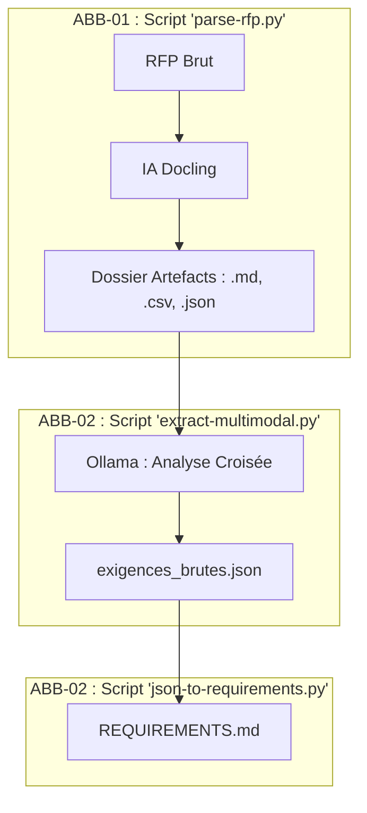

# 🧠 DOSSIER D'ARCHITECTURE : Distinction Scripts ABB-01 / ABB-02

## 1. VISION STRATÉGIQUE : La ligne de démarcation
L'architecture sépare strictement la **Certification (01)** de la **Qualification (02)** pour éviter toute pollution des exigences par des erreurs de formatage.

---

## 2. MODÈLE DE DONNÉES PAR ÉTAPE

### Étape 01 (Certification)
- **Input** : Binaire (.pdf, .xlsx).
- **Output** : Artefacts normalisés. On ne parle pas encore d'exigences, mais de "données structurées".

### Étape 02 (Qualification)
- **Input** : Artefacts (.md + .csv).
- **Output** : Référentiel métier. C'est ici que l'intelligence métier intervient via le LLM.

---

## 3. LOGIQUE DE FIABILITÉ (Passage de relais)
L'ABB-02 ne peut être lancé que si l'ABB-01 a validé le **Score de Confiance**.
- Si `parse-rfp.py` génère un score < 0.70 sur une section, l'opérateur doit corriger le Markdown avant de lancer `extract-multimodal.py`.

---
*Master Knowledge v2.2.0 — Segmenté par Scripts.*
