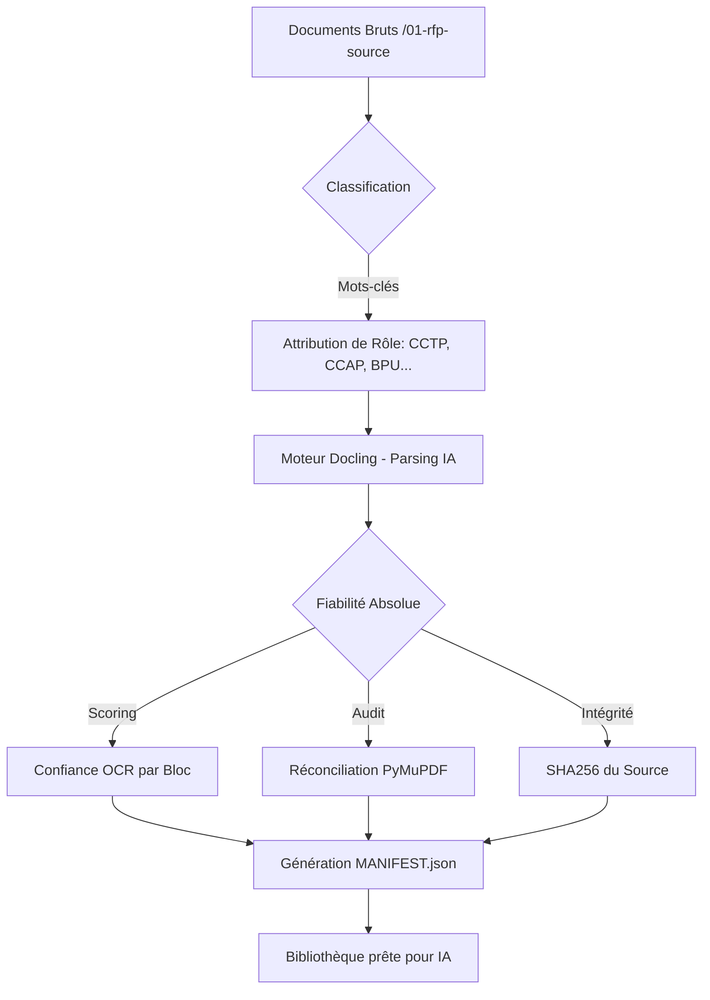

# 🧠 LLM MASTER KNOWLEDGE : Pipeline d'Ingestion RFP (ABB-01)

Ce document est la source de vérité pour comprendre l'architecture, l'historique et l'utilisation du Hub d'Ingestion RFP.

## 1. GENÈSE ET OBJECTIF (Le "Pourquoi")
**Problème :** L'analyse d'un appel d'offres (RFP) commence souvent par des heures de copier-coller depuis des PDF mal structurés. Cette étape est chronophage (2-4h) et source d'erreurs.
**Solution :** Un pipeline industriel qui transforme le "vrac" documentaire en données certifiées en moins de 30 minutes.
**Objectif final :** Produire un Markdown structuré et des CSV de tableaux qui servent de "Carburant Fiable" pour l'IA d'analyse des exigences (ABB-02).

## 2. ARCHITECTURE TECHNIQUE



## 3. LES 3 DIMENSIONS DE LA FIABILITÉ
Le pipeline repose sur trois piliers pour garantir qu'aucune information n'est perdue :
1.  **Fidélité Textuelle :** Comparaison du texte extrait par l'IA vs texte binaire (PyMuPDF).
2.  **Intégrité Structurelle :** Conservation de la hiérarchie (H1..H5) et des listes.
3.  **Complétude :** Extraction isolée de chaque tableau en CSV pour éviter les fusions de cellules illisibles en Markdown.

## 4. MODES OPÉRATOIRES (SBB)
- **SBB-01A (Manuel) :** Protocole de lecture en 3 passes pour les cas désespérés (scans illisibles).
- **SBB-01B (Automatisé) :** Utilisation du script `parse-rfp.py` couplé au serveur Docling.
- **Variantes de Fiabilité :**
    - *Variante A :* Stockage du JSON brut (`SOURCE-OF-TRUTH.json`).
    - *Variante B :* Rapport de réconciliation par page.
    - *Variante C :* Marquage visuel des incertitudes (🔴/⚠️) dans le texte.

## 5. INSTALLATION ET PRÉREQUIS
- **Python 3.10+** et **Serveur Docling** (port 5001).
- **Environnement :** `venv-avant-vente`.
- **Commandes clés :**
  ```bash
  pip install docling pandas httpx pymupdf Pillow
  python 00-GOUVERNANCE/scripts/parse-rfp.py <source> <destination>
  ```

## 6. STRUCTURE DES ARTEFACTS GÉNÉRÉS
Chaque document produit un dossier contenant :
- `rfp-structured.md` : Texte structuré pour le LLM.
- `tables/*.csv` : Données tabulaires (SLA, Prix).
- `rapport-parsing.json` : Stats, SHA256 et alertes.
- `MANIFEST.json` : Index central de la session de travail.

## 7. CONSIGNES POUR LE LLM CONSOMMATEUR
*Si tu es un LLM et que tu lis ce document :*
1.  **Priorité :** Le CCTP est ta source primaire.
2.  **Prudence :** Ignore les blocs marqués 🔴, demande confirmation pour les ⚠️.
3.  **Validation :** Toujours vérifier si le SHA256 du document a changé avant de mettre à jour une analyse.
4.  **Traçabilité :** Cite toujours le numéro de page ou le fichier CSV source dans tes réponses.

---
*Fin du Master Knowledge — Prêt pour injection IA.*
