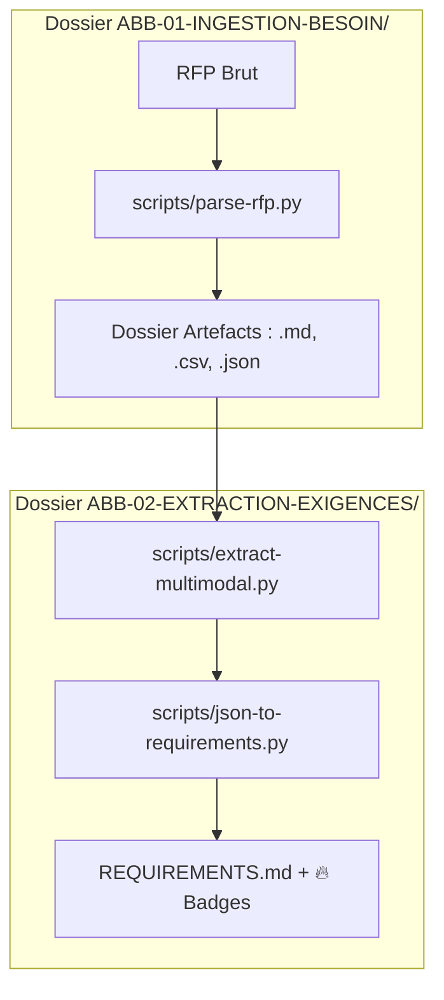

# 🧠 DOSSIER D'ARCHITECTURE : Hub d'Intelligence Multimodale

## 1. VISION STRATÉGIQUE : La Ligne de Confiance
L'architecture garantit l'intégrité de l'analyse en séparant la **Certification** de la donnée brute de sa **Qualification** métier.

## 2. MODÈLE DE DONNÉES ET FIABILITÉ
Le pipeline opère sur trois piliers de robustesse :

1. **Hachage Global** : Le `source_hash` (ABB-02) couvre désormais l'intégralité du dossier d'artefacts (Markdown + tous les CSV). Toute modification d'un chiffre dans un tableau invalide l'extraction.
2. **Batching Déterministe** : Découpage par blocs de 30k caractères avec tri alphabétique des tableaux pour une injection reproductible.
3. **Double Audit de Confiance** :
   - **ABB-01** calcule le score OCR.
   - **ABB-02** interprète les marqueurs (🔴/⚠️) pour flaguer les exigences incertaines.

## 3. LOGIQUE D'EXTRACTION MULTIMODALE
Le script `extract-multimodal.py` injecte les tableaux CSV dans le **contexte système** (permanent). 
*Règle d'or IA* : Si un chiffre (SLA, pénalité) diffère entre le texte et le tableau, le **CSV prime**.

## 4. RÉFÉRENTIEL MÉTIER (`REQUIREMENTS.md`)
Le document final est protégé contre la corruption de format (échappement des caractères `|`). 
Les exigences jugées **critiques** par l'IA sont marquées du badge 🔥 pour attirer l'attention de l'architecte lors de la revue Gate 1.

---
*Master Knowledge v2.7.0 — Certifié pour Ingestion Industrielle.*
