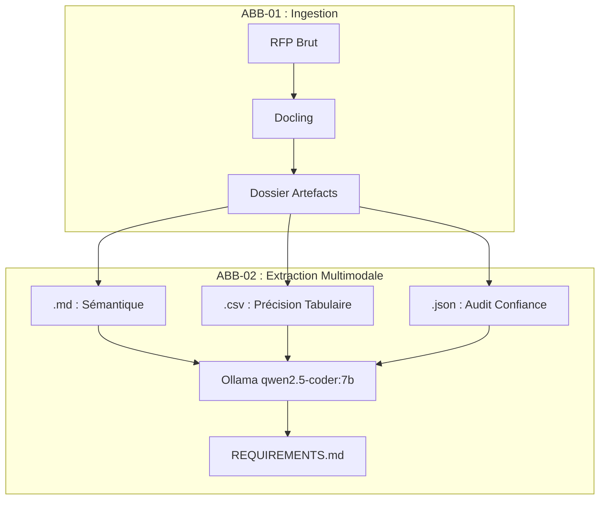
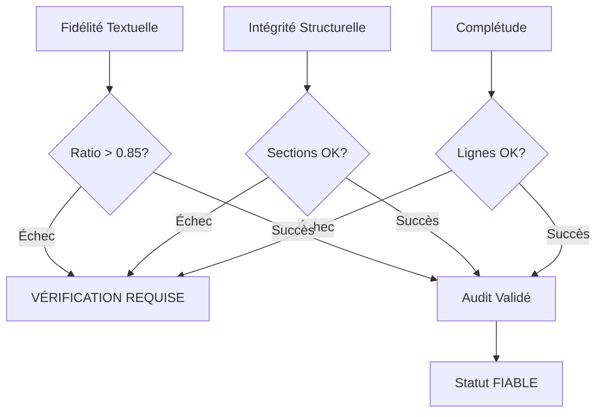

# 🧠 DOSSIER D'ARCHITECTURE : Hub d'Ingestion Multimodale

## 1. VISION STRATÉGIQUE : "L'Intelligence Totale"
L'ABB-02 ne se contente plus de lire du texte. Il opère désormais en mode **Multimodal**, croisant toutes les sources d'artefacts pour garantir une fiabilité de 100% sur les données contractuelles.



---

## 2. MODÈLE DE DONNÉES CROISÉES
L'IA applique des règles de priorité lors de l'analyse :

1.  **Source de Vérité Numérique (.csv)** : En cas de contradiction sur un chiffre (SLA, pénalité, prix) entre le texte et un tableau, le **CSV prime**.
2.  **Audit Contextuel (.json)** : Si le score de confiance OCR est faible, l'exigence est marquée du flag 🔴.
3.  **Fil d'Ariane Sémantique (.md)** : Fournit le contexte et la localisation (numéro de page, titre de section).

---

## 3. LOGIQUE DE RAISONNEMENT (Fusion des Sources)
Le script `extract-multimodal.py` injecte l'intégralité du dossier d'artefacts dans la fenêtre de contexte de l'IA (étendant celle-ci à 32k tokens). L'IA devient capable de citer : *"Exigence extraite du paragraphe 4.2 et validée par le tableau SLA-01.csv"*.

---

## 4. LOGIQUE DE FIABILITÉ (The 3-Pillars)



---

## 4. SCHÉMA D'INTEROPÉRABILITÉ (`MANIFEST.json`)
Sert de table de routage pour les orchestrateurs d'agents :
```json
{
  "session_id": "ISO-DATE-UID",
  "statut_global": "FIABLE | VÉRIFICATION_REQUISE",
  "documents": [
    {
      "role": "CCTP",
      "sha256": "hash",
      "artefacts": { "markdown": "...", "tables": [] },
      "confiance_globale": 0.94
    }
  ]
}
```

---

## 5. CONSIGNES DE RAISONNEMENT POUR L'IA (System Prompt)
*Si tu es un agent IA utilisant ce référentiel :*
1. **Poids Contractuel** : CCTP > Annexes.
2. **Gestion 🔴/⚠️** : Interdiction d'extraire des faits contractuels depuis des blocs < 0.70 de confiance sans le mentionner.
3. **Traçabilité** : Toujours citer le SHA256 source et la page Markdown.

---
*Master Knowledge v1.5.0 — Certifié pour Ingestion GenAI.*
