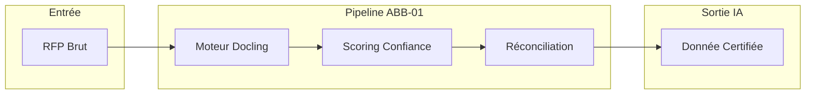
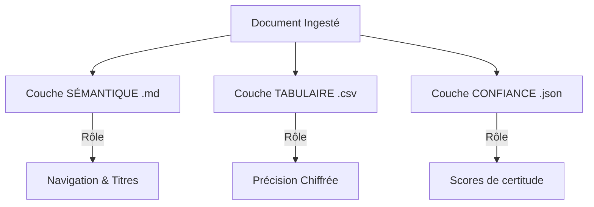
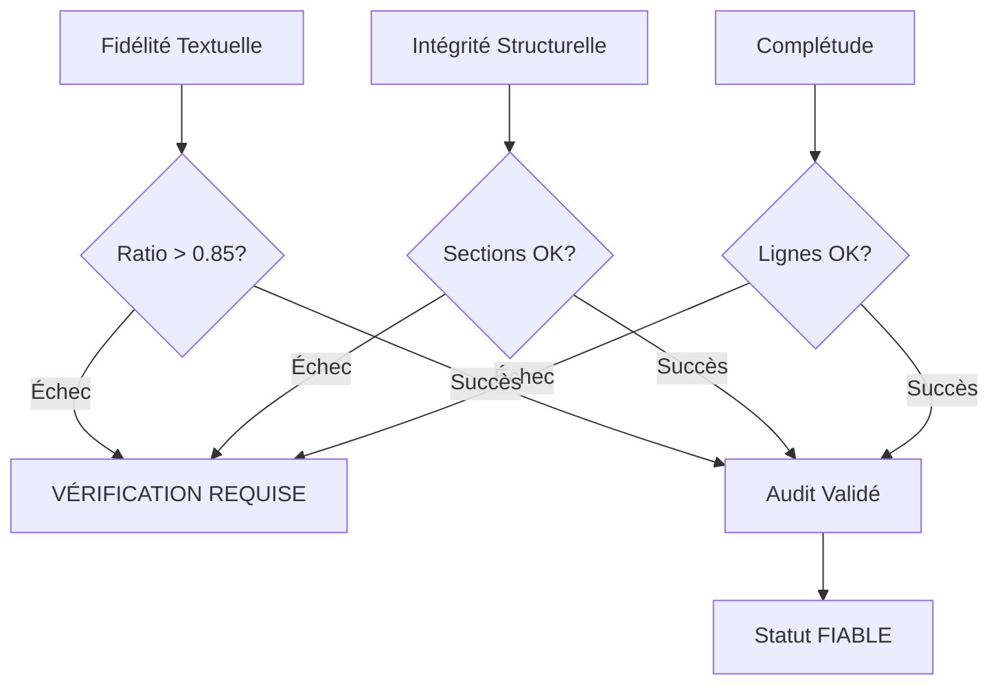
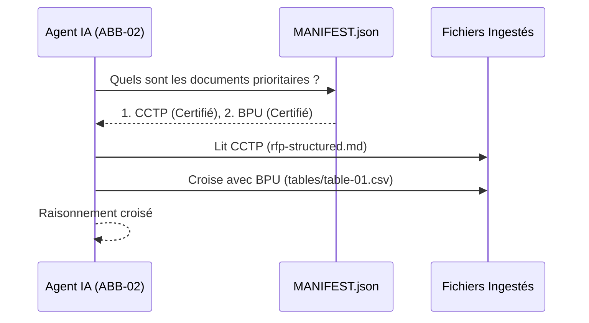

# 🧠 DOSSIER D'ARCHITECTURE : Hub d'Ingestion RFP (ABB-01)

## 1. VISION STRATÉGIQUE : "De la donnée brute à la donnée IA"
L'objectif est de transformer un flux de documents hétérogènes (PDF, Excel, Word) en une **Base de Vérité Certifiée**. Ce pipeline agit comme un filtre de qualité pour éviter les hallucinations des modèles de langage (LLM).

---

## 2. ARCHITECTURE DES COUCHES DE DONNÉES
Pour maximiser la précision, nous séparons le document en **3 couches indépendantes** mais reliées. Cela permet à l'IA de choisir le meilleur format selon la question posée.

- **Sémantique** : Arbre hiérarchique pour le chunking et la navigation.
- **Tabulaire** : Extraction brute des cellules pour éviter la corruption du Markdown.
- **Confiance** : Audit de chaque mot (OCR Confidence Score).

---

## 3. LE CYCLE DE FIABILITÉ (The 3-Pillars)
Nous ne faisons pas confiance aveuglément à l'IA de parsing. Le pipeline vérifie l'extraction via trois dimensions :

---

## 4. MÉTRIQUES DE CONFIANCE OPÉRATIONNELLES
L'IA doit adapter son raisonnement en fonction des marqueurs visuels insérés dans le texte :

| Icône | Seuil Confiance | Comportement IA Attendu |
|:--- |:--- |:--- |
| ✅ | **> 0.90** | **Affirmation directe**. La donnée est contractuelle. |
| ⚠️ | **0.70 - 0.90** | **Prudence**. L'IA doit dire : "Sous réserve de vérification..." |
| 🔴 | **< 0.70** | **Refus**. L'IA doit dire : "Donnée illisible, intervention humaine requise." |

---

## 5. ORCHESTRATION PAR LE MANIFESTE
Le `MANIFEST.json` sert de "Table de Routage" pour les agents IA. Il permet de traiter un lot de documents comme une seule entité cohérente.

---

## 6. CONSIGNES DE RAISONNEMENT (Prompting)
*Instructions fondamentales pour tout LLM consommant cette architecture :*

1. **Hiérarchie Contractuelle** : En cas de conflit, le **CCTP** (Technique) prime sur tout, sauf sur le **CCAP** pour les aspects juridiques/financiers.
2. **Audit SHA256** : Avant de répondre, valide que l'ID du document (sha256) est identique à celui de ta session précédente.
3. **Zéro-Invention** : Si une information est absente des 3 couches, réponds : "Donnée non trouvée dans le référentiel certifié".

---
*Master Knowledge v1.3.0 — Architecture Pédagogique pour GenAI.*
