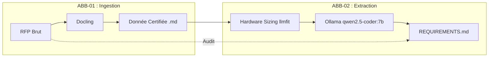
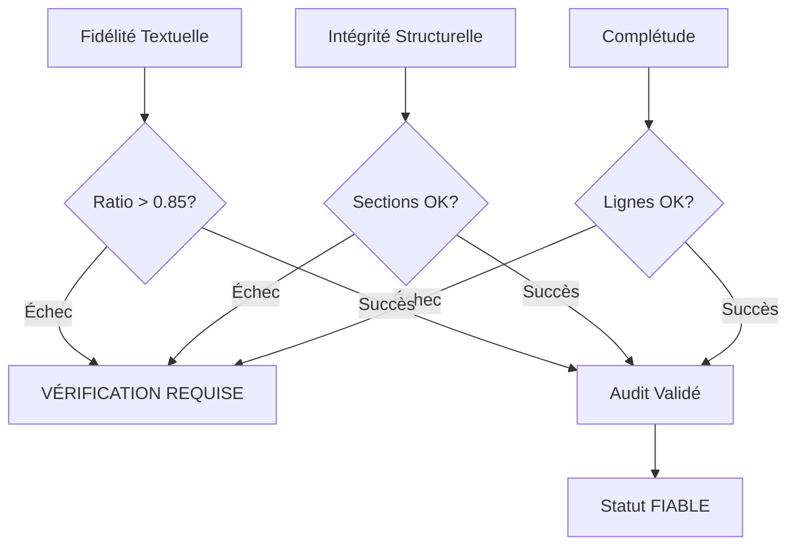

# 🧠 DOSSIER D'ARCHITECTURE : Hub d'Ingestion & Extraction RFP

## 1. VISION STRATÉGIQUE GENAI
Transformer des documents non structurés en **Contexte Actionnable** pour LLM en garantissant la fidélité binaire et sémantique.



---

## 2. MODÈLE DE DONNÉES EN COUCHES
L'IA opère sur trois couches pour minimiser les hallucinations :

1. **Couche Sémantique (.md)** : Structure hiérarchique (Arbre de sections).
2. **Couche Tabulaire (.csv)** : Données de précision (Matrices SLA/Prix).
3. **Couche Confiance (.json)** : Métadonnées d'audit (Score OCR, SHA256).

---

## 3. DIMENSIONNEMENT MATÉRIEL ET IA (ABB-02)
L'étape d'extraction s'appuie sur une infrastructure 100% locale pour des raisons de confidentialité de données :
- **Outil de sizing** : `llmfit` évalue la RAM et le CPU disponibles pour s'assurer que le modèle tournera sans out-of-memory.
- **Modèle recommandé** : `qwen2.5-coder:7b`. Ce modèle de 7 milliards de paramètres, quantifié en Q4_K_M ou supérieur, offre le meilleur compromis Vitesse/Logique pour la tâche ardue de l'extraction d'exigences contractuelles.

---

## 4. LOGIQUE DE FIABILITÉ (The 3-Pillars)



---

## 4. SCHÉMA D'INTEROPÉRABILITÉ (`MANIFEST.json`)
Sert de table de routage pour les orchestrateurs d'agents :
```json
{
  "session_id": "ISO-DATE-UID",
  "statut_global": "FIABLE | VÉRIFICATION_REQUISE",
  "documents": [
    {
      "role": "CCTP",
      "sha256": "hash",
      "artefacts": { "markdown": "...", "tables": [] },
      "confiance_globale": 0.94
    }
  ]
}
```

---

## 5. CONSIGNES DE RAISONNEMENT POUR L'IA (System Prompt)
*Si tu es un agent IA utilisant ce référentiel :*
1. **Poids Contractuel** : CCTP > Annexes.
2. **Gestion 🔴/⚠️** : Interdiction d'extraire des faits contractuels depuis des blocs < 0.70 de confiance sans le mentionner.
3. **Traçabilité** : Toujours citer le SHA256 source et la page Markdown.

---
*Master Knowledge v1.5.0 — Certifié pour Ingestion GenAI.*
